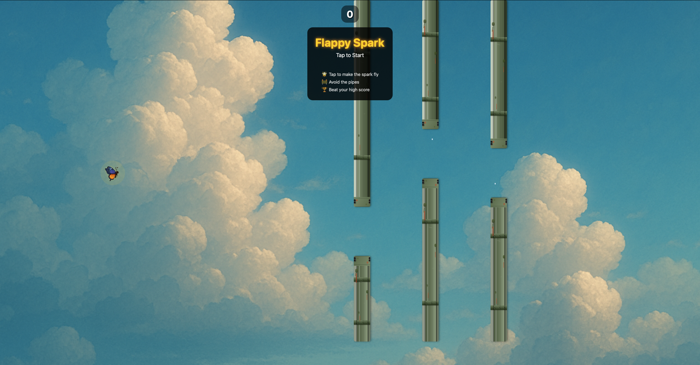

# 🌟 Flappy Spark

<div align="center">

A beautiful and engaging Flappy Bird-style mobile game built with React Native and Expo. Guide a magical spark (butterfly) through challenging pipe obstacles while collecting points!

[](https://opensource.org/licenses/MIT)
[](https://flappy-spark-stix26.surge.sh)
[](https://flappy-spark-stix26.surge.sh)

**Created by [stix26](https://github.com/stix26)**

</div>

---

## 🎮 **PLAY NOW - LIVE DEMO**

<div align="center">

### 🚀 **[► PLAY FLAPPY SPARK ◄](https://flappy-spark-stix26.surge.sh)**

> **🌐 Live URL:** https://flappy-spark-stix26.surge.sh
> 
> **📱 Works on:** Desktop, Mobile, Tablet  
> **⚡ Features:** Full gameplay, animations, haptic feedback  
> **🎯 Ready to play:** No installation required!

</div>

---

## 📸 **Game Preview**

<div align="center">
  


*Beautiful butterfly character navigating through weathered bronze pipes with stunning sky background and magical particle trails*

</div>

---

## ✨ **Key Features**

<div align="center">

| 🎮 **Gameplay** | 🎨 **Visuals** | 📱 **Platform** | ⚡ **Performance** |
|:---:|:---:|:---:|:---:|
| Smooth physics | Animated butterfly | Cross-platform | 60fps gameplay |
| Realistic gravity | Weathered pipes | iOS, Android, Web | Native animations |
| Haptic feedback | Particle trails | Responsive design | Optimized build |
| Score tracking | Dynamic background | Touch controls | Fast loading |

</div>

### 🦋 **Character & Animation**
- Beautiful butterfly with wing-flapping motion and magical particle trails
- Golden glow effects with pulsing animations
- Smooth rotation and scaling based on physics

### 🏗️ **Visual Design**
- Weathered bronze/copper pipe textures with realistic aging effects
- Dynamic cloudy sky background with depth
- Water droplet animations and detailed joint styling

### 🎯 **Game Mechanics**
- Realistic gravity and flap mechanics with delta-time calculations
- Collision detection with pixel-perfect accuracy
- Progressive difficulty and score system

---

## 🛠️ **Tech Stack**

<div align="center">

| **Frontend** | **Development** | **Deployment** |
|:---:|:---:|:---:|
| React Native 0.79.1 | TypeScript | Surge.sh (Live) |
| Expo 53.x | Bun Runtime | Vercel Ready |
| React Native Web | ESLint | Netlify Ready |
| Expo Router | Hot Reload | GitHub Pages |

</div>

**Key Technologies:**
- **React Native Reanimated** - High-performance animations
- **Expo Linear Gradient** - Beautiful gradient effects
- **NativeWind** - Utility-first styling
- **Zustand** - Lightweight state management

---

## 🚀 **Quick Start**

### **Prerequisites**
- **Bun** (recommended) or Node.js 18+
- **Expo Go** app (for mobile testing)

### **Installation & Setup**

```bash
# 1. Clone the repository
git clone https://github.com/stix26/flappy-spark.git
cd flappy-spark

# 2. Install dependencies
bun install

# 3. Start development server
bun run start-web    # Web version
bun start            # Mobile version with tunnel
```

### **Available URLs**
- **Local:** http://localhost:8081
- **Network:** Available on your LAN
- **Tunnel:** Shareable URL for remote testing

---

## 🎮 **How to Play**

<div align="center">

| **Action** | **Control** | **Result** |
|:---:|:---:|:---:|
| 🚀 **Fly Up** | Tap/Click Screen | Butterfly flaps upward |
| 🌊 **Fall Down** | No Input | Gravity pulls down |
| 🎯 **Score** | Pass Through Pipes | +1 Point per pipe |
| 🔄 **Restart** | Tap After Game Over | New game begins |

</div>

**Objective:** Navigate the butterfly through pipe gaps to score points while avoiding collisions!

---

## 📁 **Project Structure**

```
flappy-spark/
├── 📱 app/                     # Expo Router pages
│   ├── index.tsx              # Main game screen
│   ├── _layout.tsx            # Root layout
│   └── +not-found.tsx         # 404 page
├── 🧩 components/             # Game components
│   ├── Spark.tsx              # Animated butterfly
│   ├── Pipe.tsx               # Pipe obstacles
│   ├── GameOverlay.tsx        # UI overlays
│   └── ScoreDisplay.tsx       # Score system
├── ⚙️ constants/              # Configuration
│   └── gameConfig.ts          # Game settings
├── 📝 types/                  # TypeScript definitions
│   └── game.ts                # Game interfaces
├── 🎨 assets/                 # Media files
│   ├── images/                # Icons & sprites
│   └── screenshots/           # Game previews
└── 📋 Configuration files
    ├── app.json               # Expo config
    ├── vercel.json           # Vercel deploy
    └── netlify.toml          # Netlify deploy
```

---

## ⚙️ **Configuration**

Game parameters in `constants/gameConfig.ts`:

<div align="center">

| **Category** | **Settings** | **Values** |
|:---:|:---:|:---:|
| **Physics** | Gravity, Flap Velocity, Max Fall | 800, -350, 500 |
| **Character** | Size, Position | 30px, 30% from left |
| **Obstacles** | Width, Speed, Spacing, Gap | 60px, 200px/s, 250px, 180px |
| **Colors** | Spark, Pipes, Effects | Customizable palette |

</div>

---

## 🚀 **Deployment**

### **🌐 Live Demo**
**Current:** [https://flappy-spark-stix26.surge.sh](https://flappy-spark-stix26.surge.sh)
- ✅ **SSL Secured** - HTTPS connection
- ✅ **Global CDN** - Fast worldwide access
- ✅ **Mobile Optimized** - Works on all devices

### **Build & Deploy**

```bash
# Build for production
bun run build

# Deploy options
npx surge dist your-domain.surge.sh    # Surge.sh
# Auto-deploy via GitHub to Vercel/Netlify
```

### **Mobile App Store**
```bash
# Configure signing in app.json
eas build --platform all
```

---

## 🔧 **Development**

### **Available Scripts**
- `bun run start-web` - Web development server
- `bun run start` - Mobile development with tunnel
- `bun run build` - Production build
- `bun run preview` - Test build locally
- `bun run lint` - Code quality check

### **Development Features**
- ⚡ **Hot Reload** - Instant updates
- 📝 **TypeScript** - Full type safety
- 🔍 **ESLint** - Code quality
- 🛠️ **Expo Dev Tools** - Debugging suite

---

## 🤝 **Contributing**

1. **Fork** the repository
2. **Create** feature branch: `git checkout -b feature/amazing-feature`
3. **Make** your changes and test thoroughly
4. **Commit** changes: `git commit -m 'Add amazing feature'`
5. **Push** to branch: `git push origin feature/amazing-feature`
6. **Open** a Pull Request

---

## 📄 **License**

<div align="center">

[](https://opensource.org/licenses/MIT)

**MIT License** - Free for commercial and personal use

| **✅ Permissions** | **❌ Limitations** | **ℹ️ Conditions** |
|:---:|:---:|:---:|
| Commercial use | Liability | License notice |
| Modification | Warranty | Copyright notice |
| Distribution | | |
| Private use | | |

</div>

---

## 🙋‍♂️ **Support & Contact**

<div align="center">

**Created with ❤️ by [stix26](https://github.com/stix26)**

[](https://github.com/stix26/flappy-spark/issues)
[](https://flappy-spark-stix26.surge.sh)

*For questions or support, please open an issue on GitHub.*

**Enjoy playing Flappy Spark! 🌟**

</div>